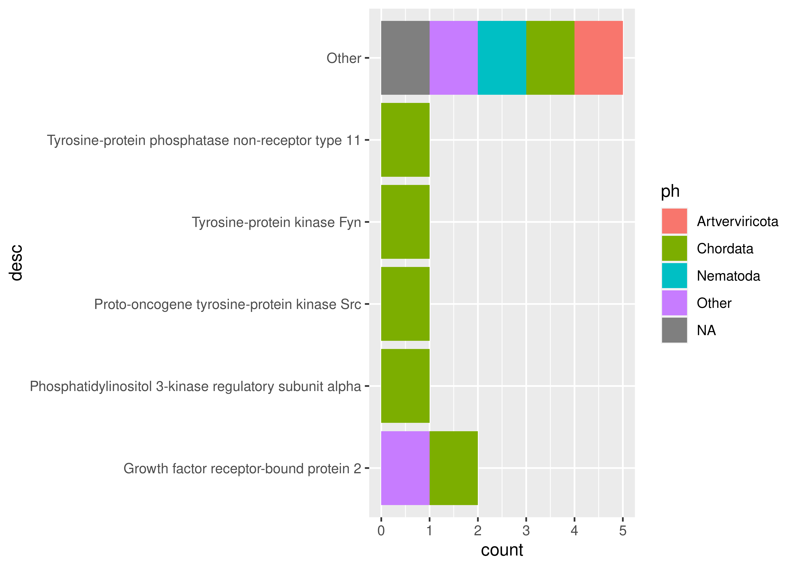

<!-- README.md is generated from README.Rmd. Please edit that file -->

# toolkit4pySCA

<!-- badges: start -->

[](https://github.com/currocam/toolkit4pySCA/actions)
<!-- badges: end -->

The goal of toolkit4pySCA is to provide a bunch of useful functions in
order to obtain a sequence alignment using HMMER and associated
taxonomic information.Then, it allows to read the file generated by
pySCA and to analyze the results easily with R and tidyverse.

## Installation

You can install the development version of toolkit4pySCA from
[GitHub](https://github.com/) with:

``` r
# install.packages("devtools")
devtools::install_github("currocam/toolkit4pySCA")
```

## Example

This is a basic example showing how to carry out a typical workflow.

### phmmer

First, we performed a search for sequences homologous to the sequence of
interest using phmmer, indicating the sequence of interest and the
database. This can be done using `quick_AA_search_using_phmmer`,
`download_xml_from_phmer()` or downloading the xml file from the web
server. Actually, programmatic access to the HMMER only seems to make
sense if you need to perform a lot of queries and want to automate the
process.

``` r
library(toolkit4pySCA)
library(Biostrings)

# >2abl_A mol:protein length:163  ABL TYROSINE KINASE
example.seq <- AAString(
  paste0("MGPSENDPNLFVALYDFVASGDNTLSITKGEKLRVLGYNHNGEWCEAQTKNGQGWVPSNYITPVNSLE",
  "KHSWYHGPVSRNAAEYLLSSGINGSFLVRESESSPGQRSISLRYEGRVYHYRINTASDGKLYVSSESRFNTLAELV",
  "HHHSTVADGLITTLHYPAP")
  )
db <- "pdb"
raw.xml <- quick_AA_search_using_phmmer(example.seq, db)
raw.xml %>%
  read_xml() %>%
  write_xml(xml.document,file = "2abl_A_pdb.xml")
xml.document <- read_xml("2abl_A_pdb.xml")
```

``` r
library(dplyr)
hits <- extract_tidy_hits_from_xml(xml.document)
stats <- extract_tidy_stats_from_xml(xml.document)
hits%>%
  select(pvalue, evalue, score) %>%
  summary()
```

<table class="table" style="margin-left: auto; margin-right: auto;">
<thead>
<tr>
<th style="text-align:left;">
</th>
<th style="text-align:left;">
pvalue
</th>
<th style="text-align:left;">
evalue
</th>
<th style="text-align:left;">
score
</th>
</tr>
</thead>
<tbody>
<tr>
<td style="text-align:left;">
</td>
<td style="text-align:left;">
Min. :-265.00
</td>
<td style="text-align:left;">
Min. :0.0000000
</td>
<td style="text-align:left;">
Min. : 14.20
</td>
</tr>
<tr>
<td style="text-align:left;">
</td>
<td style="text-align:left;">
1st Qu.: -39.72
</td>
<td style="text-align:left;">
1st Qu.:0.0000000
</td>
<td style="text-align:left;">
1st Qu.: 22.80
</td>
</tr>
<tr>
<td style="text-align:left;">
</td>
<td style="text-align:left;">
Median : -27.96
</td>
<td style="text-align:left;">
Median :0.0000004
</td>
<td style="text-align:left;">
Median : 35.00
</td>
</tr>
<tr>
<td style="text-align:left;">
</td>
<td style="text-align:left;">
Mean : -35.80
</td>
<td style="text-align:left;">
Mean :0.0341706
</td>
<td style="text-align:left;">
Mean : 46.09
</td>
</tr>
<tr>
<td style="text-align:left;">
</td>
<td style="text-align:left;">
3rd Qu.: -19.29
</td>
<td style="text-align:left;">
3rd Qu.:0.0023000
</td>
<td style="text-align:left;">
3rd Qu.: 51.62
</td>
</tr>
<tr>
<td style="text-align:left;">
</td>
<td style="text-align:left;">
Max. : -13.21
</td>
<td style="text-align:left;">
Max. :1.0000000
</td>
<td style="text-align:left;">
Max. :369.80
</td>
</tr>
</tbody>
</table>

``` r
library(forcats)
hits%>%
  mutate(
    ph = fct_lump(ph, 2),
  ) %>%
  pull(ph)%>%
  fct_count(prop = TRUE, sort = TRUE) %>%
  kbl() %>%
  kable_styling(position = "center")
```

<table class="table" style="margin-left: auto; margin-right: auto;">
<thead>
<tr>
<th style="text-align:left;">
f
</th>
<th style="text-align:right;">
n
</th>
<th style="text-align:right;">
p
</th>
</tr>
</thead>
<tbody>
<tr>
<td style="text-align:left;">
Chordata
</td>
<td style="text-align:right;">
504
</td>
<td style="text-align:right;">
0.9130435
</td>
</tr>
<tr>
<td style="text-align:left;">
Other
</td>
<td style="text-align:right;">
21
</td>
<td style="text-align:right;">
0.0380435
</td>
</tr>
<tr>
<td style="text-align:left;">
Ascomycota
</td>
<td style="text-align:right;">
19
</td>
<td style="text-align:right;">
0.0344203
</td>
</tr>
<tr>
<td style="text-align:left;">
NA
</td>
<td style="text-align:right;">
8
</td>
<td style="text-align:right;">
0.0144928
</td>
</tr>
</tbody>
</table>

``` r
library(ggplot2)
hits%>%
  filter(evalue < 0.001) %>%
  mutate(
    ph = fct_lump(ph, 2),
    desc = fct_lump(desc, 4)
  )%>%
  ggplot(aes(y=desc, fill = ph)) + 
    geom_histogram(stat = "count")
```



``` r
library(progressr)
{tax.df <- hits %>%
    pull(taxid) %>%
    download_tax_from_ncbi() %>%
    mutate(taxid = as.numeric(taxid))} %>%
  with_progress()
#> Registered S3 method overwritten by 'hoardr':
#>   method           from
#>   print.cache_info httr

hits %>%
  left_join(tax.df, by = c("taxid" = "taxid"))
#> # A tibble: 552 × 33
#>    name   acc    arch     archScore archindex  bias desc    evalue extlink flags
#>    <chr>  <chr>  <chr>        <dbl> <chr>     <dbl> <chr>    <dbl> <chr>   <dbl>
#>  1 2abl_A 2abl_A PF00018…         4 23636274…   2.8 ABL … 4.5e-110 https:…     3
#>  2 5mo4_A 5mo4_A PF00018…         5 22258305…   3   Tyro… 3.1e-108 https:…     3
#>  3 2fo0_A 2fo0_A PF00018…         5 22258305…   3   Prot… 3.1e-108 https:…     3
#>  4 1opk_A 1opk_A PF00018…         5 22258305…   3   Prot… 3.1e-108 https:…     3
#>  5 1opl_A 1opl_A PF00018…         5 22258305…   3   prot… 3.6e-108 https:…     3
#>  6 6amv_A 6amv_A PF00018…         4 23636274…   3.4 Tyro… 1.7e-107 https:…     3
#>  7 3t04_A 3t04_A PF00017…         2 49054433…   3.9 Tyro… 2.5e- 67 https:…     3
#>  8 5dc0_B 5dc0_B PF00017…         2 49054433…   3.8 Tyro… 4.1e- 67 https:…     3
#>  9 1ab2_A 1ab2_A PF00017…         2 49054433…   3.3 C-AB… 1.5e- 61 https:…     3
#> 10 4xey_B 4xey_B PF00017…         3 77813800…   2.8 Tyro… 3.4e- 61 https:…     3
#> # … with 542 more rows, and 23 more variables: kg <chr>, ndom <dbl>,
#> #   nincluded <dbl>, niseqs <dbl>, nregions <dbl>, nreported <dbl>, ph <chr>,
#> #   pvalue <dbl>, score <dbl>, sindex <dbl>, species <chr>, taxid <dbl>,
#> #   taxlink <chr>, superkingdom <chr>, kingdom <chr>, subphylum <chr>,
#> #   superclass <chr>, class <chr>, order <chr>, suborder <chr>, family <chr>,
#> #   subfamily <chr>, genus <chr>
```

You’ll still need to render `README.Rmd` regularly, to keep `README.md`
up-to-date. `devtools::build_readme()` is handy for this. You could also
use GitHub Actions to re-render `README.Rmd` every time you push. An
example workflow can be found here:
<https://github.com/r-lib/actions/tree/v1/examples>.
